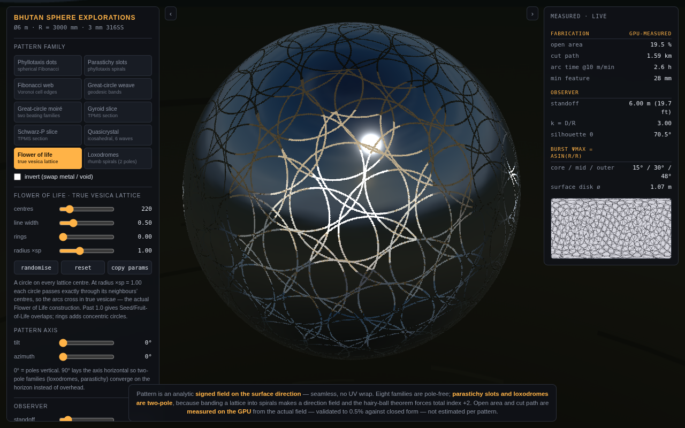

# Bhutan Sphere Explorations

Real-time study bench for seamless geometric cutout patterns on a sphere.

**Ø6 m shell · R = 3000 mm · 3 mm 316 stainless**

Ten pattern families — phyllotaxis, great-circle moiré, triply-periodic minimal surfaces,
icosahedral quasicrystal, Flower of Life, loxodromes — each parametric and evaluated live,
with GPU-measured open area and cut-path length for every configuration.



---

## Run it

It is a single self-contained HTML file. No build step, no dependencies, no network.

```bash
open index.html          # macOS
xdg-open index.html      # Linux
```

## Deploy

**Vercel** — import the repo, framework preset **Other**, leave build command empty,
output directory `.`. `vercel.json` is already configured.

```bash
npx vercel --prod
```

**GitHub Pages** — Settings → Pages → deploy from branch, root. `index.html` is served directly.

---

## Why the pattern is a field, not geometry

The cutout is not modelled as holes cut in a mesh. It is a **signed scalar field on the
surface direction**:

```
f(n) < 0  →  void (cut away)
f(n) > 0  →  metal
```

evaluated per-fragment and resolved with `discard`. Two consequences matter:

1. **Seamless and pole-free by construction.** The field is a function of the 3-D direction
   vector, so there is no UV wrap, no seam, and no pole — the pattern simply *is* defined
   everywhere on the sphere. The one exception is the loxodrome family, which is two-pole
   by definition.
2. **Instant.** Changing family or dragging a parameter is a uniform update, not a geometry
   rebuild, so exploration is genuinely real-time.

Edge antialiasing uses a 4×4 Bayer dither against screen-space coverage from `fwidth(f)`,
which gives smooth hole edges without transparency (transparency would break depth
sorting on a double-sided shell).

### The hairy-ball constraint

Worth stating because it governs what is achievable. Any continuous tangent **direction
field** on S² must carry total index +2 — you cannot comb a sphere. For an unoriented line
field the cheapest distribution is four +½ disclinations; for a hexagonal tiling it is
exactly twelve pentagonal defects at icosahedral vertices (Euler). So:

- Patterns built from **scalar 3-D fields** (gyroid, Schwarz-P, quasicrystal) have no
  defects at all — nothing is being combed.
- Patterns built from **point lattices** (phyllotaxis, Flower of Life) are quasi-uniform
  with no defect clustering, because a Fibonacci lattice has no global hexagonal order to
  frustrate.
- Patterns that impose a **direction** (parastichy spirals, loxodromes) must pay the index
  +2 and therefore have two convergence points. Aim them deliberately with the axis
  control — they read as vortex centres.

---

## Measurement

Open area and cut path are **measured from the actual field**, not estimated per pattern.

The field is rendered over a 2048×1024 Lambert cylindrical equal-area map, so every texel
carries identical solid angle. Counting void texels gives open area directly. Boundary
length uses the co-area formula:

```
Perimeter = ∫ δ(f) |∇f| dA  ≈  (1/2h) ∫ |∇f| dA   over the band {|f| < h}
```

With the band half-width set adaptively as `h = 1.5·ε·|∇f|`, the `|∇f|` cancels and the
estimator collapses to `(4π / 3ε) × band-fraction` — independent of how any given field is
scaled, which is what makes one implementation work for all ten families.

`ε` is auto-tuned: it must be several texels wide to be sampled, but must stay inside the
thinner of the two phases or the band clips against itself at a feature centre and the
perimeter over-reads. The solver iterates on the measured phase widths. When features get
finer than the sampler can resolve the cut-path figure turns red.

**Validated** against the closed form for *N* non-overlapping spherical caps —
area `= N(1−cos ρ)/2`, perimeter `= N·2π·sin ρ` — across six configurations:
worst area error **0.15 %**, worst perimeter error **0.27 %**.

Rotating the pattern axis is an isometry, so measurements must not change; that invariance
is used as a live self-check (worst observed drift 0.72 %).

---

## Pattern families

| # | Family | Notes |
|---|---|---|
| 0 | Phyllotaxis dots | Spherical Fibonacci lattice, Keinert *et al.* O(1) inverse mapping |
| 1 | Parastichy slots | Bands on the Fibonacci index — set arms to a Fibonacci number (8, 13, 21, 34, 55, 89) for a clean single family |
| 2 | Fibonacci web | Voronoi cell edges — a pole-free Goldberg lattice with no twelve-pentagon defect ring |
| 3 | Great-circle weave | Fibonacci-distributed poles; bands crowd toward the silhouette |
| 4 | Great-circle moiré | XOR of two families; Δ count sets the beat frequency |
| 5 | Gyroid slice | Sphere sectioned through a 3-D TPMS — chiral, organic, no symmetry axes |
| 6 | Schwarz-P slice | Cubic TPMS — reads more architectural, three axis families |
| 7 | Quasicrystal | Six plane waves on the icosahedral 5-fold axes; aperiodic but perfectly ordered |
| 8 | Flower of life | A circle on every lattice centre; at radius ×sp = 1.00 circles pass through their neighbours' centres and the arcs cross in true vesicae |
| 9 | Loxodromes | Rhumb spirals. The only two-pole family here |

Every family has an **invert** (swap metal/void) and a **pattern axis** (tilt + azimuth)
that orients the field independently of the mesh — tilt 90° lays two-pole families onto the
horizon instead of overhead.

---

## The viewer-locked burst

The interior light volume is not decoration. For a luminous body of radius *r* inside a
shell of radius *R*, a sightline through an aperture strikes the core iff

```
ψ ≤ arcsin(r / R)
```

— independent of hole size and wall thickness. Every aperture is therefore a window that
shows the core *only* near the centre of the visible disk, so the glow stays locked to the
viewer's sightline from every angle. A radially graded interior luminance `L(r)` maps
directly to the angular brightness profile `B(ψ) = L(R·sin ψ)`: the light distribution
inside *is* the corona outside.

With the observer at finite distance, `k = D/R`:

```
cos θmax = [ρ² + √((1−ρ²)(k²−ρ²))] / k        ρ = r/R
```

so the burst contracts as you approach and blooms as you retreat. See
[`docs/technical-notes.md`](docs/technical-notes.md).

---

## Fabrication notes

The HUD reports GPU-measured open area, cut path, arc time at 10 m/min, and mean void
width. Things worth watching:

- **Slug retention.** Narrow closed slots leave needle-shaped slugs that tip and tack-weld
  in the kerf. Mean void width in the HUD is the number to check against your minimum.
- **Heat input.** High pierce counts in 3 mm stainless will oil-can panels. Skip-around
  pierce sequencing and vacuum fixturing.
- **Forming.** Cut flat then form and the hole axes stay normal to the surface. Single
  curvature preserves this exactly; double curvature rotates axes ~1° and ovalises holes by
  the local membrane strain — pre-compensate by inverse-mapping through the forming strain
  field before nesting.
- **Finish.** Mirror polish fights the daylight read; the specular sky reflection sits on
  top of the aperture contrast. Satin (roughness ≈ 0.15–0.25) lifts it noticeably. On a
  brushed sphere specular streaks run *perpendicular* to grain — brush circumferentially
  for radial glints.

---

## Controls

Drag to orbit · scroll to zoom · `‹` `›` collapse the panes · **export PNG** ·
**copy params** puts the current configuration and its measurements on the clipboard as
JSON, for logging a study.

**load 360 / panorama** accepts any 2:1 equirectangular JPG/PNG and rebuilds the reflected
environment through a PMREM prefilter. The bundled environment is a procedural stand-in for
a high-altitude Himalayan valley — replace it with a real site HDRI or a stitched plaza
panorama for anything client-facing.

---

## Licence

MIT — see [LICENSE](LICENSE). Bundles [three.js](https://threejs.org) r128 (MIT).
